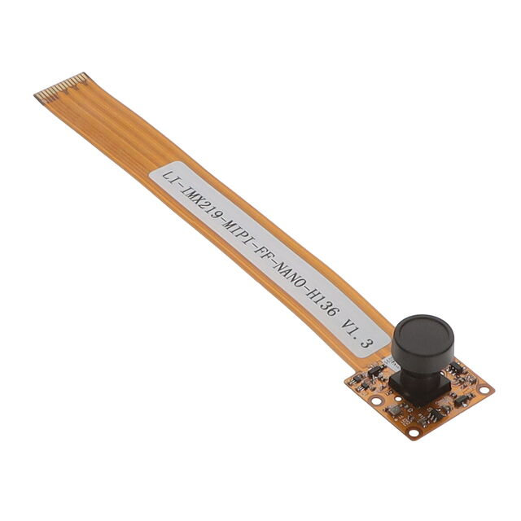

# LI-IMX219-MIPI-FF-NANO-H136 Camera Module

  

[Camera Module Datasheet](Module_Info/Camera_Module_Datasheet.pdf)

[Camera Module Purchase Link](https://www.digikey.co.uk/en/products/detail/leopard-imaging-inc/LI-IMX219-MIPI-FF-NANO-H136/21324053)

- **Purchase Date**: 02 October 2024
- **Unit Price (with VAT)**: £25.992

## Key Specifications

- **Model**: LI-IMX219-MIPI-FF-NANO-H136
- **Sensor Type**: Sony IMX219 8.08MP Color sensor
- **Active Pixels**: 3280 (H) x 2464 (V)
- **Focal Length**: 1.58mm
- **Field of View (FoV)**: 136° (Horizontal)
- **MIPI Data Interface**: CSI-2 (2 lanes)
- **Max Image Transfer Rate**: 3280 x 2464 @ 21fps
- **Power Supply**: 3.3V
  
For further technical details, refer to the attached datasheet.

## Plan for Integration

The camera module will interface with the **Ultra96-V2 FPGA** board through a custom PCB adapter. The custom PCB will handle the **MIPI CSI-2 interface** and other required connections for the **60-pin High-Speed Expansion Connector (J4)** on the Ultra96-V2.

### Other Required Parts

1.  60-pin 0.8mm connector
2. 15-pin FPC connector (compatible with the **1-1734248-5** connector)

---

Further details regarding the custom PCB will be available as part of the PCB project documentation.