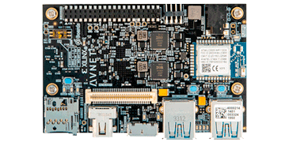

# Ultra96-V2 FPGA Board

  

[Ultra96-V2 Datasheet](Board_Info/Ultra96-V2_Datasheet.pdf)

[Ultra96-V2 More Info]([Board_Info/Ultra96-V2_Datasheet.pdf](https://www.avnet.com/wps/portal/us/products/avnet-boards/avnet-board-families/ultra96-v2/?srsltid=AfmBOopKGEY64QSdXus8ayfOvY3VUZ-1_0xrnS3fKDNxbz39Ynqmh-nl))

[Ultra96-V2 Purchase Link](https://uk.farnell.com/avnet/aes-ultra96-v2-g/sbc-arm-cortex-a53-cortex-r5/dp/3050481)

- **Purchase Date**: 01 October 2024
- **Unit Price (with VAT)**: £260.90

## Use

The **Ultra96-V2 FPGA** board will serve as the core development platform for this project.

---

